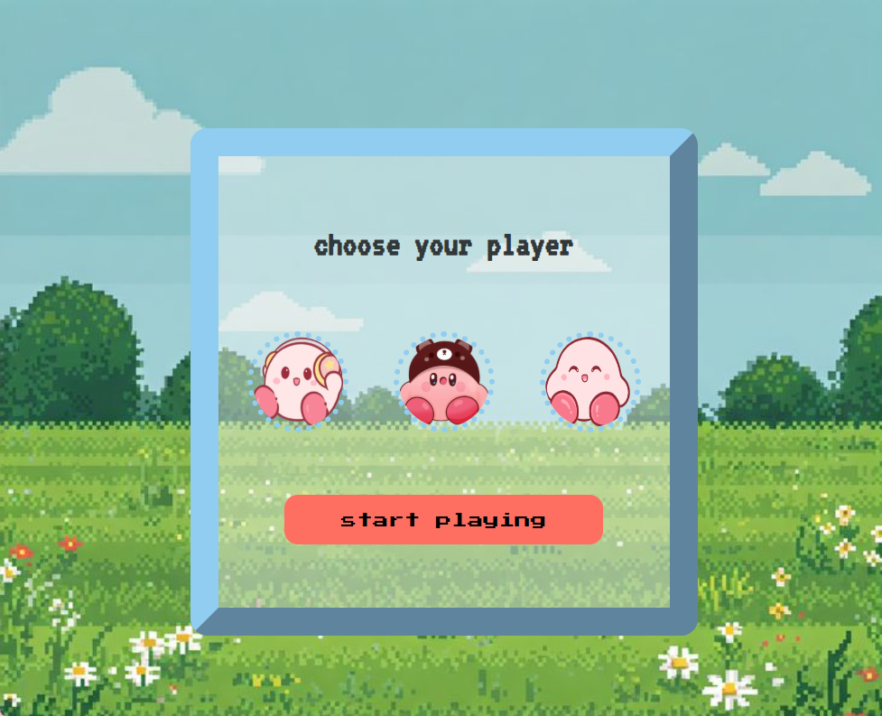
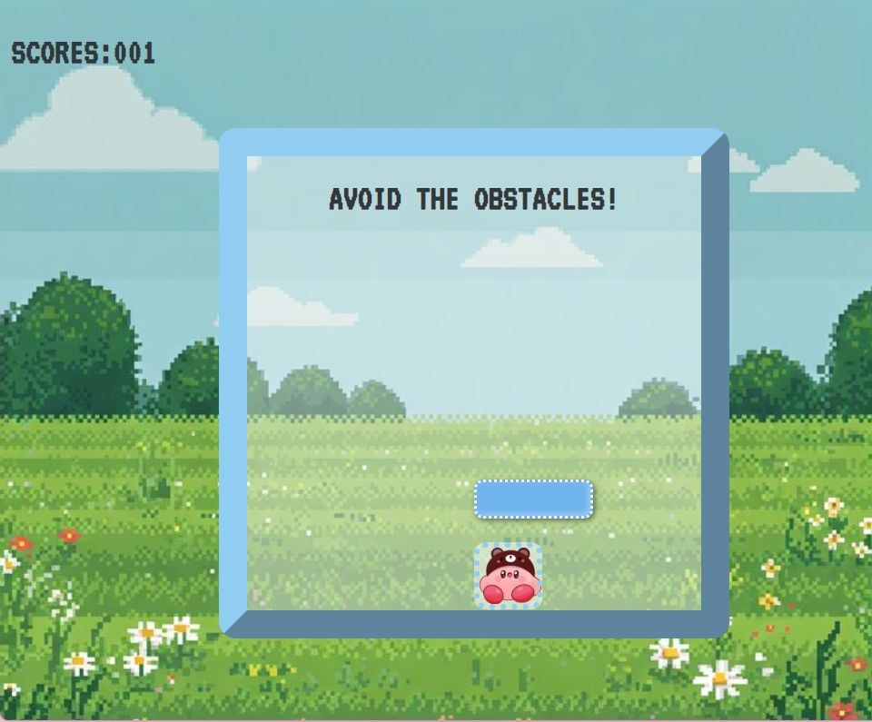

# 🎮 Dodge Game

A small desktop game built with **Electron**, **HTML**, **CSS**, and **JavaScript**.  
Choose your character, dodge the falling obstacles, and survive as long as possible!


## 🖼️ Screenshots

### Character selection


### Gameplay



## 🚀 How to Run the Game

Make sure you have **Node.js** installed.

Install dependencies:

```bash
npm install
````

Start the game:

```bash
npm start
```

Electron will automatically open the game window.

---

## ✨ Features

* 🧸 Character selection
* 🧱 Falling obstacles
* 🕹️ Smooth movement
* 🏆 Score counter
* 🌸 Cute visuals
* ⚡ Runs as a desktop Electron app

---

## 🛠️ Tech Stack

* **Electron**
* **JavaScript**
* **HTML5**
* **CSS3**

---

## 💡 About This Project

This project helped me practice:

* Basic game loops
* Keyboard controls & event listeners
* Collision detection
* Simple animations
* Structuring a small Electron project

It’s one of my fun mini-projects to explore creative coding.

---

Made with 💗 by **Douae**

```
```
